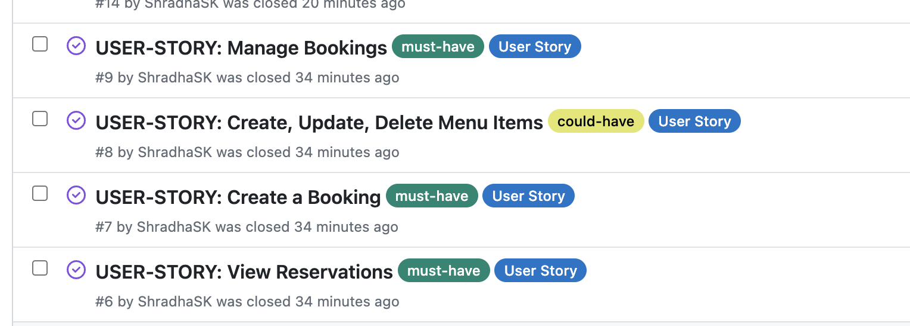
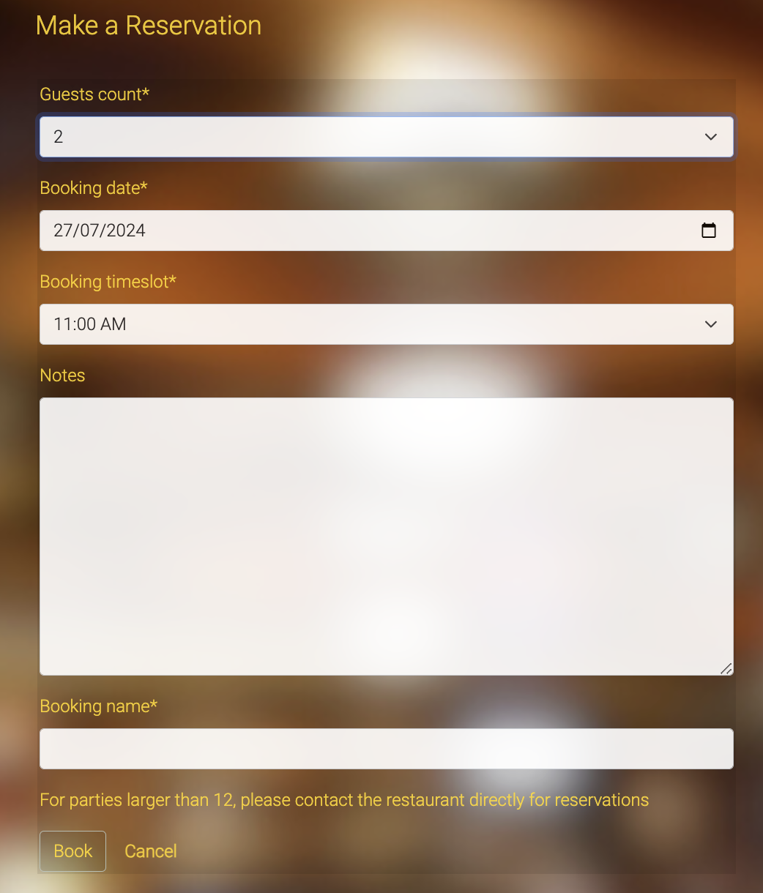

# Opal and Ember Restaurant
This website is designed for a fictitious restaurant located in Berlin.
It has been created as part of the Project Portfolio 4 for Code Institute's Diploma in Full Stack Software Development.
The development utilized a Full-Stack Toolkit, with VS Code as the IDE, and GitHub for repository management and emulation of an Agile development environment through GitHub Projects.
When completed, the website was deployed on Heroku.


## Live site

[Opal and Ember Bar & Grill](https://opal-and-ember-f121df40d11f.herokuapp.com/) _(Ctrl/Cmd + click to open in a new tab)_

## GitHub Repository

[My GitHub Repo](https://github.com/ShradhaSK/opal-and-ember)

## Table of Contents
- [User Experience](#user-experience)
- [Agile Methodology](#agile-methodology)
- [Database Schema](#database-schema)
- [Defensive Design](#defensive-design)
- [Design](#design)
- [Features](#features)
- [Testing](#testing)
- [Technologies Used](#technologies-used)
- [Deployment](#deployment)
- [Credits](#credits)

## User Experience

### Project Goals
The goals of the website include:

- **Online Visibility:** Increase the restaurant's online presence by creating a professional and easily discoverable website.
- **Menu Showcase:** Clearly present the restaurant's menu with detailed descriptions and prices to attract potential customers.
- **User-Friendly Experience:** Ensure a seamless and user-friendly experience for visitors, making it easy to navigate the website and find relevant information.
- **Online Reservations:** Implement a reservation system to allow customers to book tables conveniently through the website.
- **Contact Information:** Display accurate and up-to-date contact information, including address, phone number, and business hours, for the benefit of potential customers.
- **Responsive Design:** Ensure the website is mobile-friendly and responsive to accommodate users accessing it from different devices.
- **Social Media Integration:** Connect the website with social media platforms to leverage social sharing and engage with customers on different channels.

[Back to Contents](#table-of-contents)

### User Stories

#### Guest User
- As a guest user, I can navigate the website so that I can gain an understanding of the restaurant and its offerings. [#1](https://github.com/ShradhaSK/opal-and-ember/issues/1)

- As a website user, I can click on the food and drinks menu so that I can view the available menu items. [#2](https://github.com/ShradhaSK/opal-and-ember/issues/2)

- As a guest user I can register an account so that I can create, read, update, and delete my reservations. [#3](https://github.com/ShradhaSK/opal-and-ember/issues/3)

- As a guest user, I can view the website on any device so that I can easily navigate and explore its content across different devices. [#4](https://github.com/ShradhaSK/opal-and-ember/issues/4)

#### Existing User
- As an existing user, I can easily navigate to the login page so that I can log in into my account. [#5](https://github.com/ShradhaSK/opal-and-ember/issues/5)

- As an existing user, I can access my bookings so that I can keep track of all of my reservations. [#6](https://github.com/ShradhaSK/opal-and-ember/issues/6)

- As an existing user I can create a booking so that I can reserve a spot at the restaurant for a specific date and time. [#7](https://github.com/ShradhaSK/opal-and-ember/issues/7)


- As a logged-in user I can edit my booking so that I can change the date and / or time to better fit my convenience [#15](https://github.com/ShradhaSK/opal-and-ember/issues/15)

- As a existing user I can delete my booking so that I can accommodate a change of plans for the date and time of my booking [#16](https://github.com/ShradhaSK/opal-and-ember/issues/16)

#### Website Owner/Developer/Admin
- As a Site Admin I can create, view, update and delete menu items so that I can maintain the restaurant's menus and specials. [#8](https://github.com/ShradhaSK/opal-and-ember/issues/8)

- As a Site Admin I can create, read, update, and delete reservations (CRUD functionality) so that I can efficiently manage restaurant bookings [#9](https://github.com/ShradhaSK/opal-and-ember/issues/9)

#### For Future Implementation
- As a guest/existing user, I want to use the website's map feature to easily locate the restaurant and get directions to ensure a smooth first-time visit.

- As a guest user, I want to access the customer review section to gain insights into the restaurant's reputation and build trust before making a reservation.

- As an existing user I can reset my password so that I can quickly and securely regain access to my account.

[Back to Contents](#table-of-contents)

## Agile Methodology

Agile methodology is an iterative and flexible approach to project management and software development that prioritizes adaptability, collaboration, and customer satisfaction. It emphasizes incremental progress, continuous feedback, and the ability to respond to changing requirements throughout the development process.

The principles of agile methodology have been followed during the website development, incorporating the below key aspects:

### GitHub Projects/Kanban Board
GitHub Projects was used to manage the development process following an agile methodology. The project board, accessible through this [link](https://github.com/users/ShradhaSK/projects/2), served as a practical tool for organizing tasks and tracking progress.

### MoSCoW Prioritization

The MoSCoW method was employed for task prioritization, categorizing them into Must-Haves, Could-Haves, and Won't-Fix.





### User Stories and Bugs

I designed templates for streamlined user story and bug creation.


[Back to Contents](#table-of-contents)

## Database Schema
The data model for the restaurant project adheres to Object-Oriented Programming principles and utilizes Django's Class-Based Views. The **user authentication system** is powered by Django AllAuth.
Facilitating table bookings involves the incorporation of a **custom reservation model**. This model captures essential details like booking name, booking date and time, number of guests, and any additional notes from guests. More importantly, the reservation model establishes a One-to-Many with the User model with the user ID as the Foreign key, ensuring that all reservations associated with a specific user is stored properly.
LucidChart was used to create the ER Diagram.


[Back to Contents](#table-of-contents)

## Defensive Design

### Form Validation:

Comprehensive form validation mechanisms have been implemented. In the event of incorrect or empty data during form submission, the form submission is prevented and a user-friendly error message is displayed. This ensures users promptly receive feedback about the errors.

### Cross-Site Request Forgery (CSRF) Protection:

The website employs CSRF tokens on all forms across the site, adding an extra layer of defense against cross-site request forgery attacks.

[Back to Contents](#table-of-contents)

## Design

The primary design goal for this restaurant website is to create an intuitive, visually appealing, and responsive interface that prioritizes user experience. The design aims to seamlessly guide users through the website, ensuring easy navigation and quick access to essential information. A clean and visually engaging layout will enhance the presentation of the restaurant's cuisine. Additionally, the overall aesthetic will reflect the restaurant's brand identity, creating a cohesive and inviting online presence that aligns with the establishment's atmosphere and values.

### Colour Scheme

The decision behind the color palette for this website is anchored in the principles of simplicity and elegance. A deliberately limited color palette has been chosen to maintain a clean and uncluttered visual appearance, contributing to a straightforward and user-friendly design.
By employing a restrained color scheme, the focus is directed towards essential elements.
This approach to color selection aims to create a harmonious and visually pleasing design.


### Typography

The project employs the Roboto font from Google Fonts throughout.
Roboto is a distinguished typeface renowned for its elegant and versatile design. With a modern and sophisticated aesthetic that perfectly adapts to the design intent of the website.


## Features

### Logo

I conceptualized a restaurant name and created a logo using [Canva].(https://www.canva.com/) The logo represents an elegance associated with fine-dining.


### Navigation Bar

- The navigation bar looks the same on every page, made with Bootstrap to work well on all screen sizes.

- When the user is logged in the navigation options expand including *Book a Table*, *My Bookings*, and *Logout* 


- When the user is new/not logged in, the Navigation bar has only *Home*, *Menus Dropdown*, *Register* and *Login* options


### Footer

The footer includes essential information such as the address and contact information, open times, and social media links.


### Home Page

The homepage features a simple yet elegant and minimal restaurant interior image, with accessible Register and Login buttons.


### Menus
The menus have been styled using BootStrap5 framework


### Register, Login, Logout

Django Allauth was used to incorporate register, login, and logout functionalities.


Users are provided with success messages upon successful login and logout actions. In case of invalid inputs, error messages are displayed to notify users of the incorrect submission.


### Book a Table
The feature comprises a custom form enabling users to make reservations. I have used tuples in the model class to provide specific selections for the number of guests and booking times, offering a tailored and user-friendly reservation experience.



Specifically for the booking time in Berlin, I have integrated *pytz* within Django, a time zone library. This provides reservation scheduling tailored to Berlin's local time.

For dates I have used a custom widget that specifically handles dates:


### My Bookings
 This feature showcases cards containing details of all reservations made by the user. 
 
 
 
 Users have two options:
 

- **Edit**


- **Delete**


### Future Implementations

A few user stories were excluded from the current project due to time limitations. [Future Improvements](https://github.com/ShradhaSK/opal-and-ember/issues?q=is%3Aopen+is%3Aissue). The following are some of features that could be implemented in future iterations and that have been added to the *future implementations* on the kanban board:

- **Specials and Promotions:** Highlight any special offers, promotions, or events to attract and engage customers.

- **Customer Reviews and Testimonials:** Incorporate a section for customer reviews and testimonials to build trust and credibility.

[Back to Contents](#table-of-contents)

## Testing
Testing documentation can be found [here](TESTING.md)

## Technologies Used

### Languages

- Python
- HTML
- CSS
- JavaScript
- Bootstrap5
- Django

### Python Modules
- [Django-allauth](https://pypi.org/project/django-allauth/) Integrated set of Django applications addressing authentication, registration, account management as well as 3rd party (social) account authentication.
- [Gunicorn](https://pypi.org/project/gunicorn/) is a Web Server Gateway Interface (WSGI) server implementation that is commonly used to run Python web applications.
- [Psycopg2](https://pypi.org/project/psycopg2/) is a PostgreSQL database adapter for Python. It allows Django to connect to PostgreSQL databases.

### Other Programs and Applications

- [Git](https://developer.mozilla.org/en-US/docs/Glossary/Git)
- [Github Pages](https://github.com/)
- [Visual Studio Code](https://code.visualstudio.com/)
- [Google Fonts](https://fonts.google.com/)
- [Google Dev Tools](https://developer.chrome.com/docs/devtools/open/)
- [Google Lighthouse](https://developer.chrome.com/docs/lighthouse/overview/)
- [Code Institutes Pep8 Checker](https://pep8ci.herokuapp.com/)
- [LucidChart](https://www.lucidchart.com/)
- [Favicon.io](https://favicon.io/)
- [canva.com](https://www.canva.com/)
- [Coolors](https://coolors.co/)
- [W3C HTML Validator](https://validator.w3.org/)
- [W3C CSS Validator](https://jigsaw.w3.org/css-validator/)
- [CI Python Pep8 Checker](https://pep8ci.herokuapp.com/)
- [PostGresSQl](https://www.postgresql.org/) used to store the database locally
- [SQLite](https://www.sqlite.org/) Owing to issues connecting to my Postgres DB instance
- [ElephantSQL](https://www.elephantsql.com/) is a PostgreSQL database hosting service
- [Heroku](https://heroku.com/) used to deploy the application

## Deployment
### Deployment Steps followed
1. Navigate to the Heroku dashboard and create a new app with a unique name.
2. Click on the Settings tab and reveal the config vars.
3. Install Gunicorn, a production-ready webserver for Heroku. Add gunicorn to the requirements.txt file
4. Create a file named Procfile at the root directory of the project (same directory as requirements.txt).
5. In the Procfile, declare this is a web process followed by the command to execute your Django project.
```web: gunicorn opal_and_ember.wsgi```
Where opal_and_ember is the name of my project.
6. Open the opal_and_ember/settings.py file and set DEBUG=False.
7. In settings.py append the Heroku hostname to the ALLOWED_HOSTS list
8. On Heroku click on the Deploy tab.
9. In the Deployment method section enable GitHub integration by clicking on Connect to GitHub.
10. Search for the Github repository and click Connect.
11. In the env.py file, the DATABASE_URL value was copied from ElephantSQL when we created our database instance.
12. Make up a new SECRET_KEY value. It can be any combination of letters, numbers and symbols.
13. Once you have your secret key, set it as an environment variable in your env.py file.
14. Modify your settings.py file to retrieve the new SECRET_KEY from the environment variables.
```SECRET_KEY = os.environ.get("SECRET_KEY")```
16. To ensure the security of your Django app on Heroku, set the SECRET_KEY as a config variable on Heroku as well and add the following Config Vars:
    - DATABASE_URL from the env.py
    - DEBUG = False
    - PORT = 8000
17. Ensure in Django settings, DEBUG is False

18. Scroll to the bottom of the deploy page and either click on Deploy Branch to deploy manually. Manually deployed branches will need re-deploying each time the repo is updated.
19. Click Open app to view the deployed site.

### Local Development

To clone the repository:

1. Go to the [GitHub repository](https://github.com/ShradhaSK/opal-and-ember);
2. Above the list of files, click the green button _<>Code_;
3. Choose your preferred method for cloning: HTTPS, or Github CLI (SSH tokens are not set up yet). Click the copy button to copy the URL to your clipboard.
4. Open Git Bash.
5. Change the current working directory to the location where you want the cloned directory.
6. Type git clone, and then paste the URL you copied earlier.
7. Press Enter. A clone will be created in your local.

## Credits

### Code

- [Code Institute Full Template](https://github.com/Code-Institute-Org/ci-full-template)
- [Django Docs](https://docs.djangoproject.com/en/3.2/)
- [Django All Auth Documentation](https://docs.allauth.org/en/latest/installation/quickstart.html)
- [Bootstrap v5.1 Docs](https://getbootstrap.com/docs/5.1/getting-started/introduction/)
- [W3Schools](https://www.w3schools.com/)
- [Stack Overflow](https://stackoverflow.com/)
- [ChatGPT](https://chatgpt.com/)

