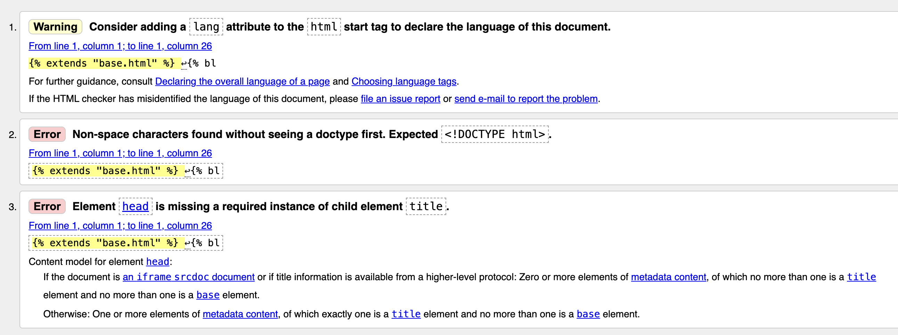
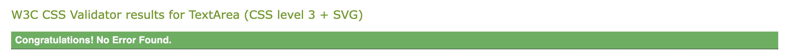
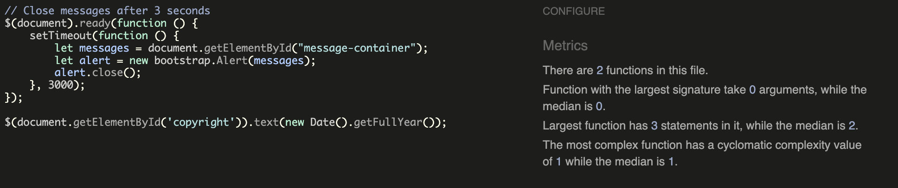

## Table of Contents - Testing
- [User Story Testing](#user-story-testing)
- [Code Validation](#code-validation)
- [Browser Testing](#browser-testing)
- [Lighthouse](#lighthouse)
- [Manual Testing](#manual-testing)
- [Bugs](#bugs)
- [Unsolved Bugs](#unsolved-bugs)

## User Story based Testing
|Test case|Notes|Result|
|----|----|----|
|As a new user I can navigate the website so that I can explore the contents of the pages|The user can navigate the website by clicking on the links in the navigation bar|✔|
|As a Site User I can click on the menu so that I can view available ordering options|A menu with description and prices of the food options is visible by clicking on the menu link|✔|
|As a Site Admin I can create, read, update, and delete reservations so that I can efficiently manage restaurant bookings|Through the admin page, the administrator has the ability to perform CRUD operations on users' reservations.|✔|
|As a Site Admin I can create, read, update, and delete menu items so that I can efficiently manage restaurant menus|Through the admin page, the administrator has the ability to perform CRUD operations on Drinks Menu Items and Food Menu items.|✔|
|As a Site User I can register an account so that I can create, update, and delete my bookings.|The user can sign up through the designated link in the navigation bar|✔|
|As a Site User I can see all my bookings so that I can keep track of all of my reservations.|A specific section to keep track of all the user's reservation has been provided in *My Bookings*|✔|
|As a Site User I can only create/update a booking for a future date and/or time|Custom validations based on user timezone to accept only future time and date|✔|
|As a Site User I cannot see expired bookings on *My Bookings* page|Custom validations based on user timezone to display only future bookings|✔|

## Code Validation
### HTML
All HTML pages were run through the [W3C HTML Validator](https://validator.w3.org/). Results in the table below

|Page|Result|
|----|----|
|bookings_list.html|✔|
|index.html|✔|
|food_menu.html|✔|
|drinks_menu.html|✔|
|edit_booking.html|✔|
|delete_booking.html|✔|
|booking.html|✔|
|confirmation_page.html|✔|
|base.html|✔|

The errors received pertain to the built-in Django functionalities, as illustrated in the screenshot, and are independent of any issues with the HTML structure.

### CSS
|File|Result|
|----|----|
|style.css|✔|

### JavaScript

The project incorporates only two JavaScript scripts, one for messages timeout and another for adding Copyright year.

### Python

|File|Result|
|----|----|
|views|✔|
|urls|✔|
|models|✔|
|forms|✔|
|admin|✔|

## Browser Testing

The Website was tested on Google Chrome, Safari, and Firefox with no issues.

## Lighthouse
I performed Lighthouse validation on all pages, evaluating accessibility and performances. The following outlines the results.

|Page|Performance|Accessibility|Best Practices|SEO|
|----|----|----|----|----|
|Home|85|98|100|100|
|Food Menu|98|93|100|100|
|Drinks Menu|99|93|100|100|
|Bookings|99|93|100|100|
|Booking|99|91|100|100|
|Cancel Booking|99|93|100|100|
|Confirmation Page|99|91|100|100|
|Edit Booking|99|93|100|100|

## Manual Testing
|Item|Action|Expected Result|Pass|
|----|----|----|----|
|Logo|Click|Redirect to Home Page|✔|
|Home link|Click|Redirect to Home Page|✔|
|Menu dropdown|Click|dropdown list with Food Menu and Drinks Menu|✔|
|Food Menu|Click|Redirect to Food menu|✔|
|Drinks Menu|Click|Redirect to Drinks menu|✔|
|Book a Table link|Click|Redirect to reservation page|✔|
|Book button|Click|Add a booking to My Bookings|✔|
|Book a Table drop down menus|Click|selection of number of guests, date, and time allowed|✔|
|Book a Table date in the past|Click|Invalid form message displayed|✔|
|Book a Table time in the past|Click|Invalid form message displayed|✔|
|Book a Table empty booking name|Blank|Invalid form message displayed|✔|
|Booking Confirmation page links|Click|Redirect either to Menu or to My Bookings page|✔|
|Login link|Click|Redirect to sign in form|✔|
|My Bookings link|Click|Redirect to the list of reservations|✔|
|Your Reservations Edit button|Click|Redirect to the edit reservation|✔|
|Your Reservations Delete button|Click|Redirect to confirmation page|✔|
|Delete reservation button|Click|Delete reservation and direct to Your Reservations page|✔|
|Cancel reservation deletion button|Click|Redirect to Your Reservations page, booking not cancelled|✔|
|Logout link|Click|Redirect to sign out confirmation page|✔|
|Sign Out button|Click|Sign out and redirect to home page|✔|
|Message success when log in and log out|Display|Temporary success alert message visible under the navigation bar|✔|
|Navbar links|Hover|Color change to dark grey|✔|
|Footer social links|Hover|Color change to dark grey|✔|
|Other links|Hover|Color change to dark grey|✔|
|Invalid forms|Display|Temporary message visible in the form|✔|

## Bugs
I have documented the bugs addressed over the development of the project on the GitHub Projects kanban. Below is a summary and links.

|Bug|Status|
|----|----|
|[Preventing Selection of Past Time/ for Bookings](https://github.com/ShradhaSK/opal-and-ember/issues/14)|Closed|

## Unsolved Bugs
No unsolved bugs reported in the project

[Back to Contents](#table-of-contents---testing)